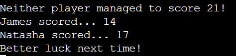

## GAME OF 21

Game of 21 is a python terminal based game, which users can run through Heroku.

The aim of the user is to have the total of 21 by the end of their 3 rolls. Thus, making them the winner. The user will also be going up against a computer player which they can name.

Link to the live website:
    https://projectporftolio3-e33d0c6856be.herokuapp.com/

## How To Play

Game of 21 is a game based off of the gambling game 'blackjack' except instead of playing cards the user has a 10 sided dice, which they roll 3 times with the end goal being that 
their total equals to 21. 

To play the game the user has to input their name and a name of their choice for the computer
player which they will be playing against. After the user has inputted this information they will be prompted to 'roll' the dice. Once the user has rolled the dice three times, the scores are collected from the user and the computer. The winner is the person who can achieve the score of 21. 

## Features

Random number generator

User is able to input their own name into the game.

User can name their 'challenger' (computer player)

Takes user input and validates whether input is valid or not and gives response if invalid.

Rolling the dice, feature

Exception handling if user attempts to input anything other than 'roll'

Adds the users results from each individual roll of the dice

Program tells user whether they are winner or not and shows their total.

## Future Features

Add a counter of how many wins/losses the user/computer has achieved.

## Testing

I have manually tested this project by doing the following:

- Tested each individual function with a print statement to ensure each function works.

- Tested the code in the Heroku app to ensure, once deployed the program functions as intended.

- Entered invalid inputs to test the error handling measures inside the code.

- When I ran my code through pep8 there were issues with empty whitespaces. These have since been removed and now when I run my code through pep8 it gets the 'All clear, no errors found' response. 

## Bugs

Solved bugs

- There was a bug involving the segment where the user inputs their name.
If the user decided to spam numbers into the input, it resulted in numerous
extra roll inputs once the initial 3 had been completed. This has since been
fixed by changing the 'break' into a 'return' at the end of the if/else statement.

- There was another bug involving the outcome of results. When the users result was 21
the message would appear saying that BOTH players had won, despite only the user getting
the winning result. I resolved this by changing the order of the elif statements and ammended
some of the syntax.

- When adding additional comments to my code, they exceeded the character limit for the 
pep8 validation. To resolve this I reduced the text within the comments.

## Validator Testing

Below are the results from when I ran my code through the pep8 validator.

 
 
   

## Deployment

This project was first deployed on Github and then was deployed through Heroku.

-Steps for deployment:
    - Fork or clone this repository
    - Create a new Heroku app
    - Set the buildbacks to Python and NodeJS in that order
    - Link the Heroku app to the repository
    - Click on Deploy

## Credits / References

- [Stackover flow](https://stackoverflow.com/questions/2052390/manually-raising-throwing-an-exception-in-python/24065533#24065533) was used as a reference example for building the exception handling for the users rolls.
- Alongside Stackover Flow, the Code Institute 'Love Sandwiches' walkthrough project was also used as a reference point for exception handling.
- [Youtube](https://www.youtube.com/watch?v=21FnnGKSRZo) Was used as an inspiration piece for 
my project idea and the random_number() function.
- [w3schools](https://www.w3schools.com/python/ref_keyword_elif.asp) Was used as a reference for the elif statements for the users results from their total score. 
- [Code Institute](https://codeinstitute.net/) The template of my README.md was taken from the example README.md from the PP3 section of the Code Institute course.
- [ChatGPT](https://chatgpt.com/?oai-dm=1) This was used as an additional support resource for syntax issues and troubleshooting. 